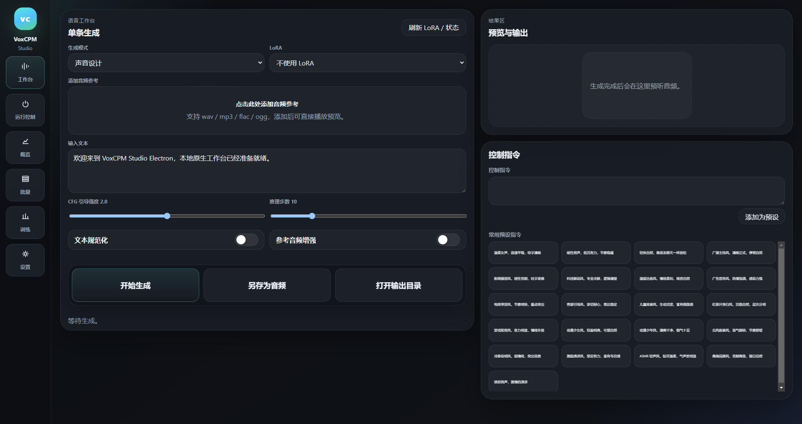
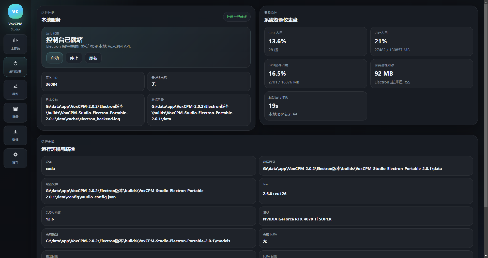
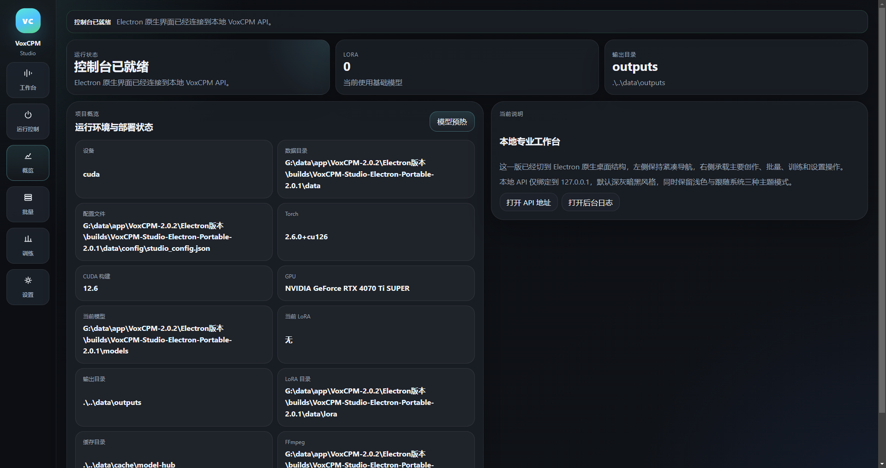
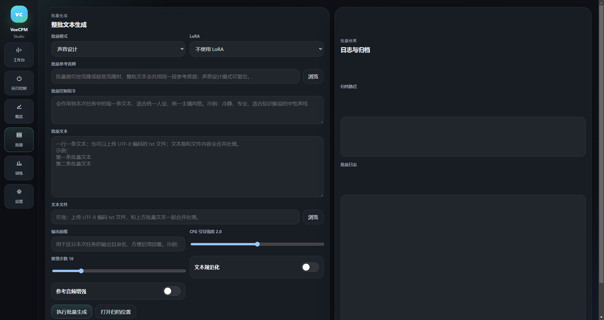
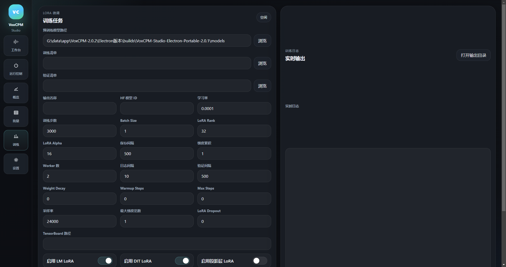
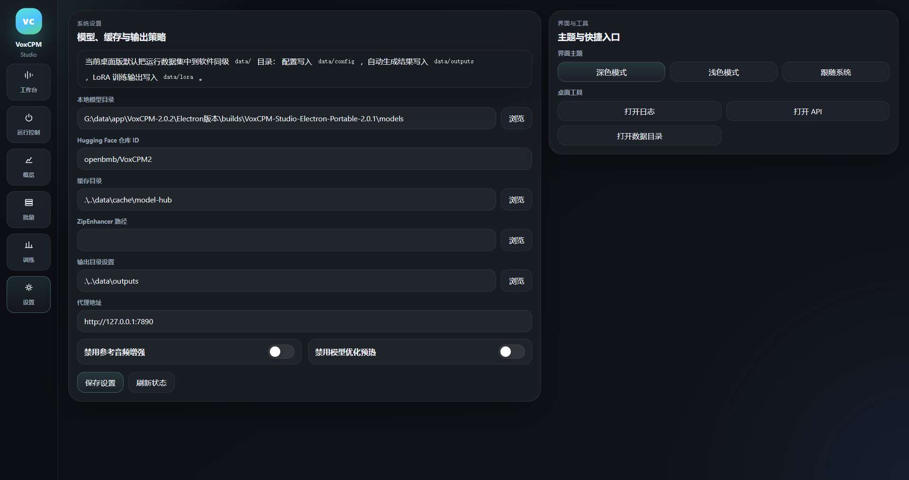

# VoxCPM Studio Electron

这是 `VoxCPM Studio` 的 Electron 原生桌面版源码仓库目录，包含：



一个面向中文本地工作流优化的 `Electron + React + TypeScript + Vite` 桌面前端，连接本地 `Python HTTP API`，覆盖：

1. 语音工作台
2. 运行控制
3. 概览
4. 批量生成
5. 训练
6. 设置

1. `frontend/voxcpm_studio_electron`
   - Electron 主进程
   - React + TypeScript + Vite 渲染层
   - 本地 Python HTTP API 桌面联动逻辑
2. `scripts`
   - Windows 便携包构建脚本
3. `docs`
   - 便携包、打包和使用说明

## 界面预览

首图展示当前首页，下面是其他页面截图：


| 页面截图 1 | 页面截图 2 |
| --- | --- |
|  |  |
|  |  |



## 目录结构

```text
Electron版本/
  frontend/
    voxcpm_studio_electron/
  scripts/
    build_windows_electron_bundle.ps1
  docs/
```

## 官方项目地址

官方 VoxCPM 项目地址：

- [OpenBMB/VoxCPM](https://github.com/OpenBMB/VoxCPM)

官方模型主页：

- [openbmb/VoxCPM2](https://huggingface.co/openbmb/VoxCPM2)

## 官方项目安装方法

根据官方项目当前 README，最直接的安装方式是：

```bash
pip install voxcpm
```

环境要求：

1. Python `>= 3.10`
2. PyTorch `>= 2.5.0`
3. CUDA `>= 12.0`

一个最小可运行示例：

```python
from voxcpm import VoxCPM
import soundfile as sf

model = VoxCPM.from_pretrained(
  "openbmb/VoxCPM2",
  load_denoiser=False,
)

wav = model.generate(
    text="VoxCPM2 是目前推荐使用的多语言语音合成版本。",
    cfg_value=2.0,
    inference_timesteps=10,
)
sf.write("demo.wav", wav, model.tts_model.sample_rate)
```

如果你希望优先从 ModelScope 下载模型到本地，可按官方说明先安装：

```bash
pip install modelscope
```

官方中文说明可继续参考当前主项目中的：

- [README_zh.md](../README_zh.md)

## Electron 前端安装方法

这套 Electron 源码仓库是 `VoxCPM Studio` 的桌面前端和打包脚本，不替代官方 VoxCPM 推理项目本身。  
也就是说：

1. 官方 `VoxCPM` 负责模型与推理能力
2. 这个仓库负责 Electron 桌面壳、前端交互、本地 API 联动和便携打包

### 前端源码安装

```bash
cd frontend/voxcpm_studio_electron
npm install
```

### 前端构建

```bash
npm run build
```

### 本地启动

如果本机 Electron 运行环境已就绪，可直接运行：

```bash
npm start
```

如需指定 Python 或模型目录，可使用环境变量：

```bash
VOXCPM_PYTHON_EXE=/path/to/python VOXCPM_MODEL_DIR=/path/to/model npm start
```

如果你在 Windows 侧配套使用本项目主目录中的后端代码，通常需要让 `desktop_api.py` 和模型目录可被当前前端工程访问。

## Windows 便携打包

Windows 下推荐使用：

```powershell
powershell -ExecutionPolicy Bypass -File .\scripts\build_windows_electron_bundle.ps1
```

更多说明见：

1. [docs/Windows便携打包说明.md](./docs/Windows便携打包说明.md)
2. [docs/Electron便携包开箱即用说明.md](./docs/Electron便携包开箱即用说明.md)
